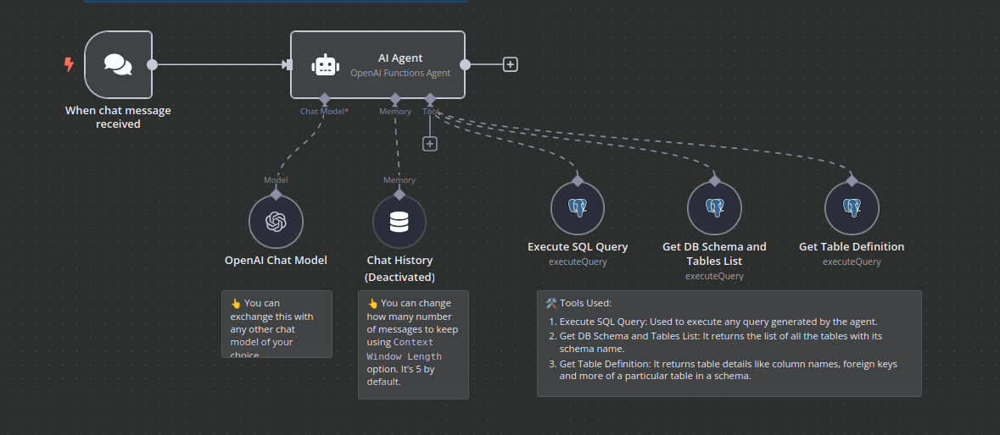

# 🚀 AI Database Assistant - Chatbot Inteligente para Consultas SQL

Um assistente de banco de dados alimentado por IA que permite conversar naturalmente com seu banco de dados PostgreSQL, executando consultas complexas através de comandos em linguagem natural.

## ✨ Recursos Principais

- 💬 Interface de chat intuitiva para interagir com seu banco de dados
- 🧠 Capacidade de entender perguntas complexas e convertê-las em SQL
- 🔍 Exploração automática de esquema e estrutura do banco de dados
- ⚡ Integração com OpenAI (GPT-4) para processamento de linguagem natural
- 🌐 Acesso remoto seguro via n8n com HTTPS

## 🛠️ Tecnologias Utilizadas

- **n8n** - Plataforma de automação e integração
- **PostgreSQL** - Banco de dados relacional
- **OpenAI API** - Modelos de linguagem avançados
- **Digital Ocean** - Hospedagem na nuvem
- **Docker** - Containerização do ambiente
- **no-ip** - DNS dinâmico com HTTPS

## 📦 Componentes do Projeto

1. **Servidor n8n** - Hospedado em uma droplet da Digital Ocean
2. **Banco de dados PostgreSQL** - Contendo dados de web scraping de produtos Samsung
3. **Workflow de automação** - Integrando chat, IA e consultas ao banco
4. **Proxy reverso** - Configuração HTTPS com certificado SSL

# Arquitetura do Sistema

## Diagrama de Componentes

## Fluxo de Dados

1. O usuário envia uma mensagem via interface de chat
2. O n8n recebe a mensagem através do webhook
3. O Agente IA processa a mensagem usando o modelo da OpenAI
4. Ferramentas de banco de dados são acionadas conforme necessário
5. A resposta é gerada e retornada ao usuário

# Configuração do Ambiente

## Pré-requisitos

- Conta na Digital Ocean
- Domínio configurado (no-ip ou similar)
- Chave API da OpenAI
- Instância PostgreSQL

## Passo a Passo

1. Criar droplet na Digital Ocean
2. Configurar DNS dinâmico
3. Instalar Docker e n8n
4. Configurar certificado SSL
5. Importar workflow para o n8n
